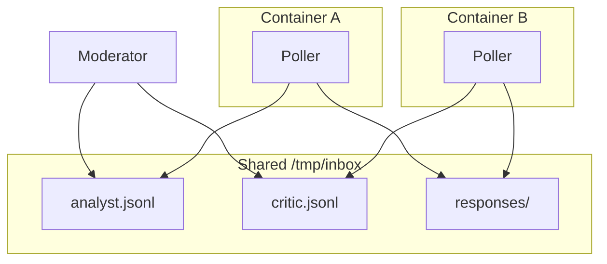
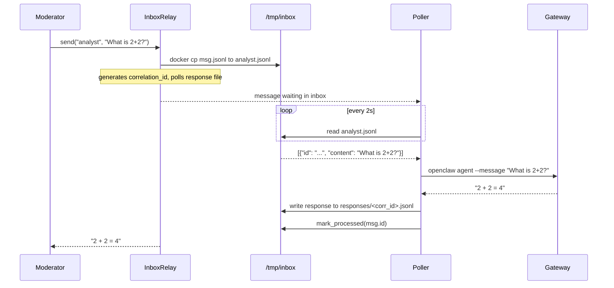
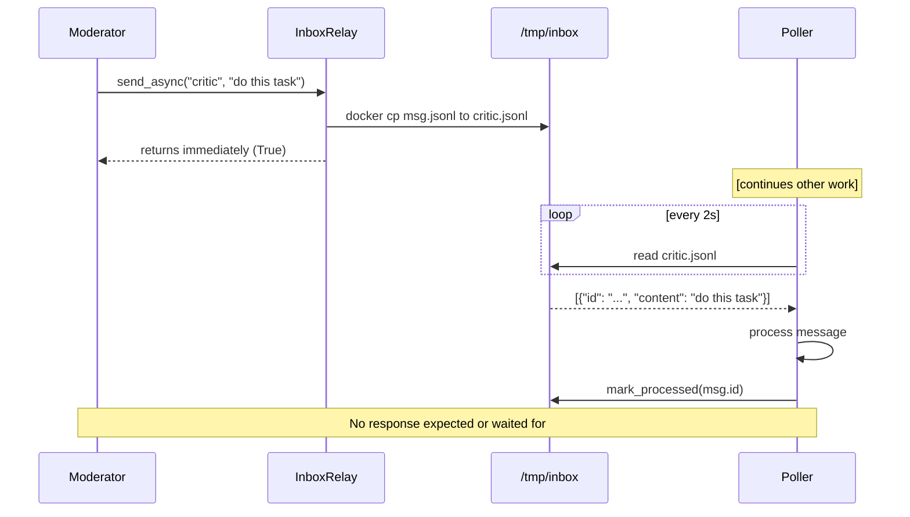

# Agentia Architecture Diagrams

Diagrams rendered with [Mermaid Live Editor](https://mermaid.live) or GitHub Markdown.

***

## 1. System Architecture



***

## 2. send() — Request/Response Flow



***

## 3. send_async() — Fire-and-Forget Flow



***

## 4. Broadcast — One-to-Many


***

## 5. Multi-Agent Conversation (Moderator Orchestration)

```mermaid
sequenceDiagram
    participant M as Moderator
    participant A as Analyst Agent
    participant C as Critic Agent

    M->>A: system: You are the Analyst
    M->>C: system: You are the Critic
    M->>A: intro: Topic Is AI helpful
    M->>C: intro: Topic Is AI helpful

    M->>A: build_prompt topic history=empty
    A-->>M: AI is helpful because
    M->>C: build_prompt topic history=Turn1
    C-->>M: However AI has drawbacks
    M->>A: build_prompt topic history=Turn1 Turn2
    A-->>M: Valid points but

Diagram 6: Poller Internal Flow

## 6. Poller Internal Flow

```mermaid
flowchart TD
    Start(["start poller --agent-id analyst"])
    Poll["poll_once()"]
    Read["inbox.read_all()"]
    Empty{msgs empty?}
    Process["for each msg: process_message()"]
    Corr{has correlation_id?}
    WriteResp["write response to responses/<corr_id>.jsonl"]
    Mark["inbox.mark_processed([ids])"]
    Sleep["sleep(poll_interval)"]
    Stop(["stop"])

    Start --> Poll
    Poll --> Read
    Read --> Empty
    Empty -->|yes| Sleep
    Empty -->|no| Process
    Process --> Corr
    Corr -->|yes| WriteResp
    Corr -->|no| Mark
    WriteResp --> Mark
    Mark --> Sleep
    Sleep --> Poll
```
