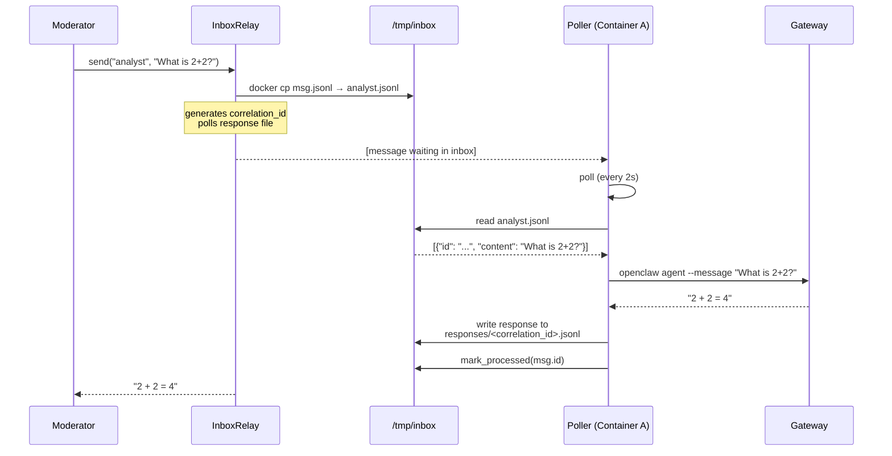
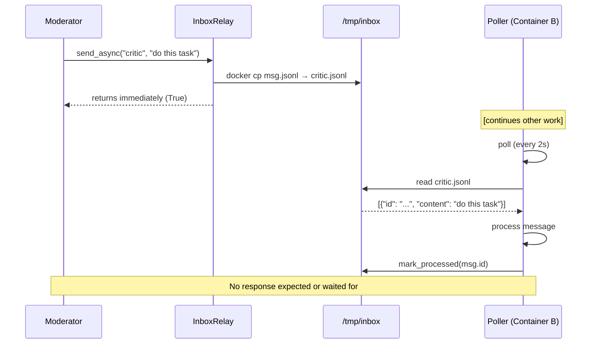
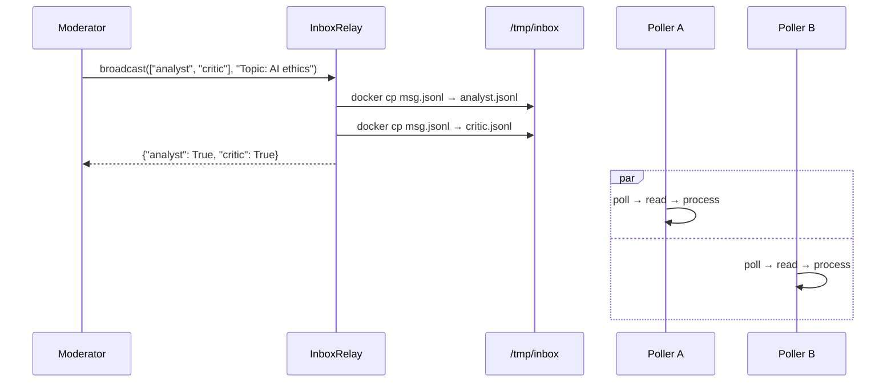
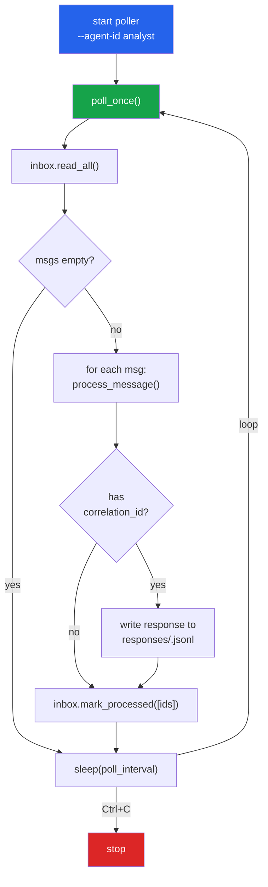

# Agentia Architecture Diagrams

Diagrams rendered with [Mermaid Live Editor](https://mermaid.live) or GitHub Markdown.

---

## 1. System Architecture

```mermaid
graph TB
    subgraph Host["Host Machine"]
        Mod["Moderator<br/>(InboxRelay)"]
        subgraph Inbox["Shared Inbox Directory<br/>/tmp/inbox"]
            A_IN["analyst.jsonl"]
            B_IN["critic.jsonl"]
            Resp["responses/"]
        end
    end

    subgraph ContainerA["Container A: analyst"]
        GA["Gateway"]
        PA["Poller<br/>(--agent-id analyst)"]
    end

    subgraph ContainerB["Container B: critic"]
        GB["Gateway"]
        PB["Poller<br/>(--agent-id critic)"]
    end

    Mod -->|"docker cp| I1"| A_IN
    Mod -->|"docker cp| I2"| B_IN
    Mod -->|"poll| Resp"| Mod
    PA -->|"read| A_IN
    PB -->|"read| B_IN
    PA -->|"write| Resp"
    PB -->|"write| Resp"

    style Mod fill:#2563eb,color:#fff
    style Inbox fill:#f3f4f6
    style Resp fill:#fef3c7
```

---

## 2. send() — Request/Response Flow



---

## 3. send_async() — Fire-and-Forget Flow



---

## 4. Broadcast — One-to-Many



---

## 5. Multi-Agent Conversation (Moderator Orchestration)

```mermaid
sequenceDiagram
    participant M as Moderator
    participant A as Analyst Agent
    participant C as Critic Agent

    M->>A: system: "You are the Analyst"
    M->>C: system: "You are the Critic"
    M->>A: intro: "Topic: Is AI helpful"
    M->>C: intro: "Topic: Is AI helpful"

    rect rgb(240, 248, 255)
        Note over M,A,C: Turn 1 — Analyst speaks
        M->>A: build_prompt(topic, history=[])
        A-->>M: "AI is helpful because..."
        M->>M: record TurnRecord(1, analyst, response)
    end

    rect rgb(255, 248, 240)
        Note over M,A,C: Turn 2 — Critic responds
        M->>C: build_prompt(topic, history=[Turn 1])
        C-->>M: "However, AI has drawbacks..."
        M->>M: record TurnRecord(2, critic, response)
    end

    rect rgb(240, 255, 248)
        Note over M,A,C: Turn 3 — Analyst rebuts
        M->>A: build_prompt(topic, history=[T1, T2])
        A-->>M: "The critic raises valid points, but..."
    end
```

---

## 6. Poller Internal Flow


